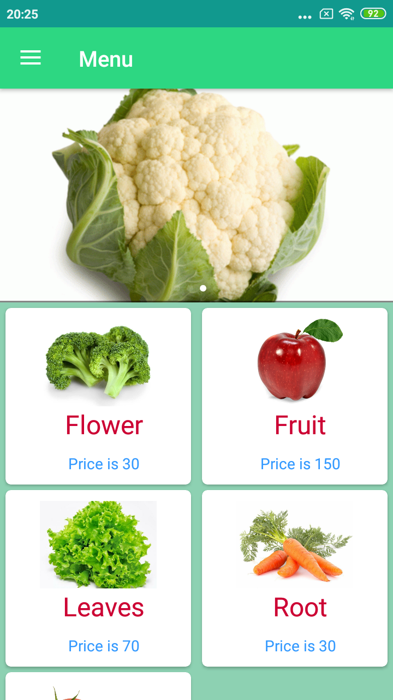
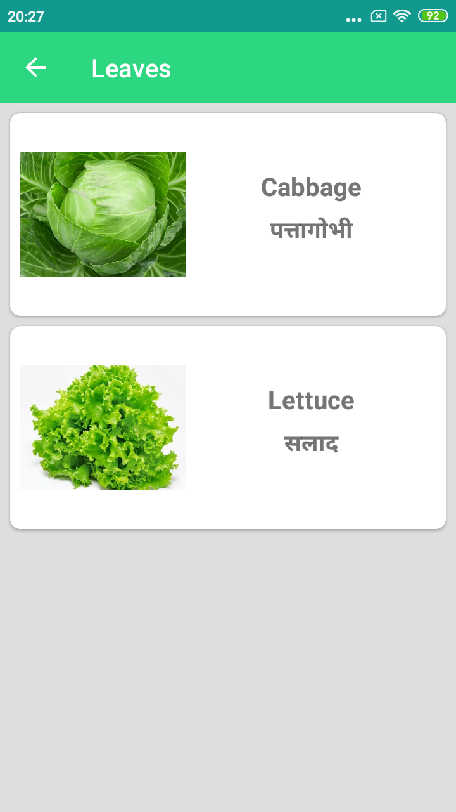
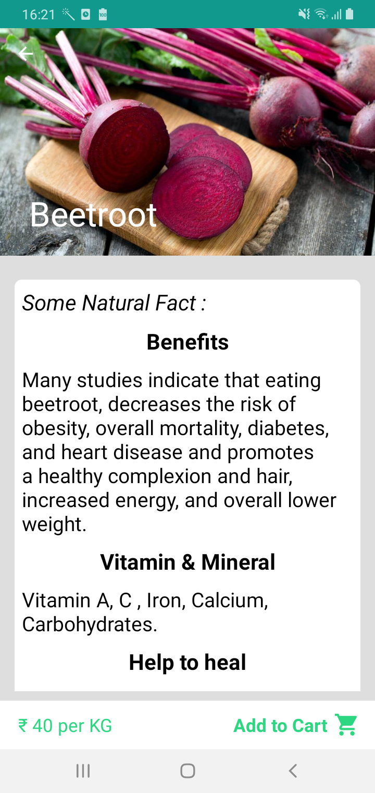
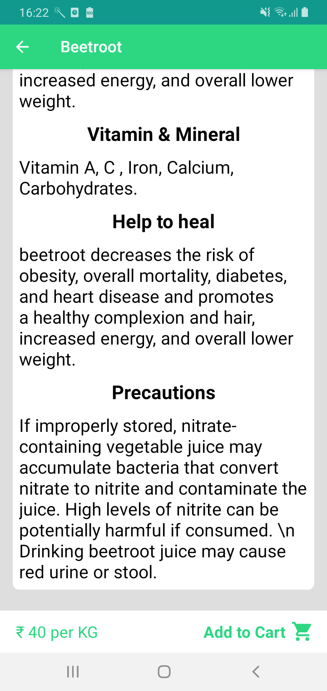
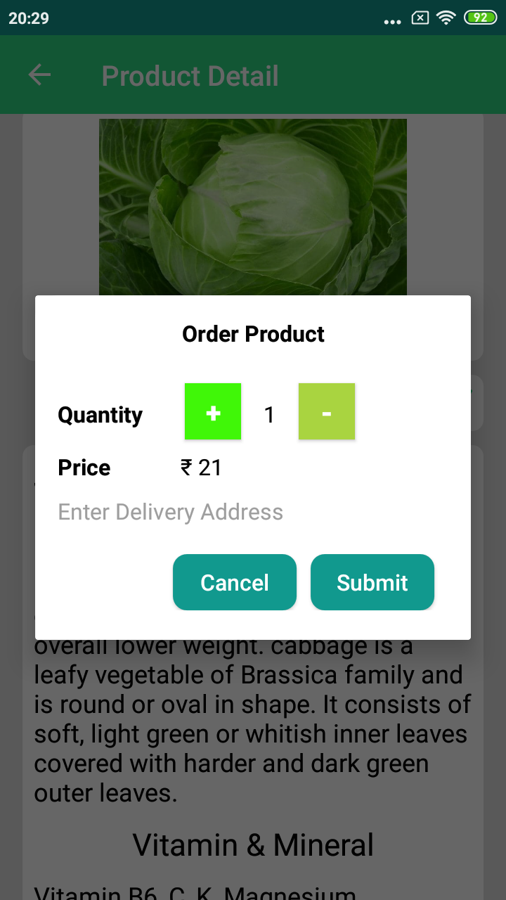
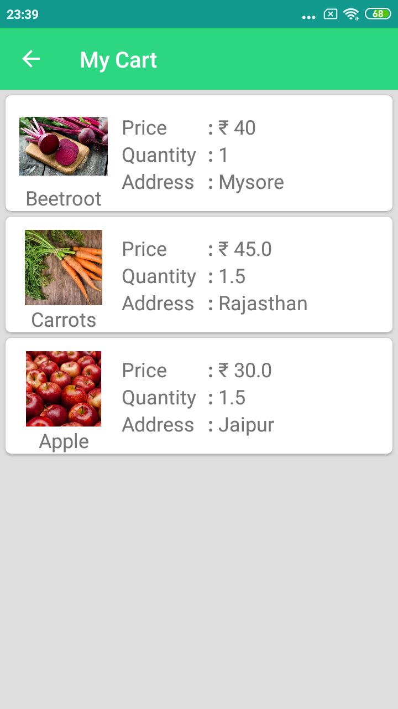

VegCart_Firebase : App for vegetable &amp; Fruit sale
-----

VegCart means Vegetable's cart/ basket, an online platform to sell vegetables. It showcase vegetables and fruits in differet category like Leaves, Salad, Root, Fruit etc. It shows detail of a vegitable and fruit which are:

- **Benefits:** It show the benefit of consumtion of that food.
- **Vitamins and Mineral:** It guide the vitamin and mineral gained.
- **Help to Heal:** It shocase the disease, unfavorable effects can be reduced by consumption of that food.
- **Precution:** As over-consumtion of anything is dangerous, same with food also. this section will indicate possible side effect of food over-consumtion.

### App Specifications: 

- [Androidx](https://developer.android.com/jetpack/androidx) and Material Design
- Kotilin 90% code, for java code can switch to [tag v2.0](https://github.com/rahulkhatri19/VegCart_Firebase/tree/v2.0)
- Use of [Constraint Layout](https://developer.android.com/training/constraint-layout) in most layout, [Collapsing toolbar](https://material.io/develop/android/components/collapsing-toolbar-layout/).
- [Picasso](https://square.github.io/picasso/) - To showcase image from url (server).
- [Firebase Realtime Database](https://firebase.google.com/docs/database): For app realtime data Firebase is used.
- Support Android Version 4.2 and above.

### App Packages:

- activity: all activity of project.
- adapter: home page adapter.
- interfaces: interface for button click
- model: all model class of project.
- utils: files which can be used in entire project.

- [Relase apk](APK/VegCart.apk) for check/Try app. 

#### App Demo video [Youtube link](https://youtu.be/o5XZ_ZXkB6I)

Screenshot
----

<table>
  <tr>
    <td>
      
    </td>
    <td>
      
    </td>
    <td>
      
    </td>
  </tr>
</table> 

<table>
  <tr>
    <td>
      
    </td>
    <td>
      
    </td>
    <td>
      
    </td>
  </tr>
</table> 

<table>
  <tr>
    <td>
      
    </td>
  </tr>
</table> 

